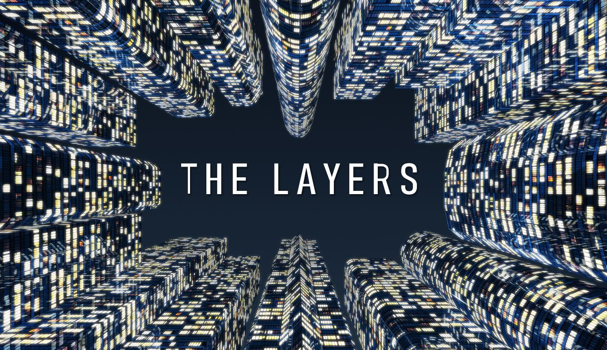
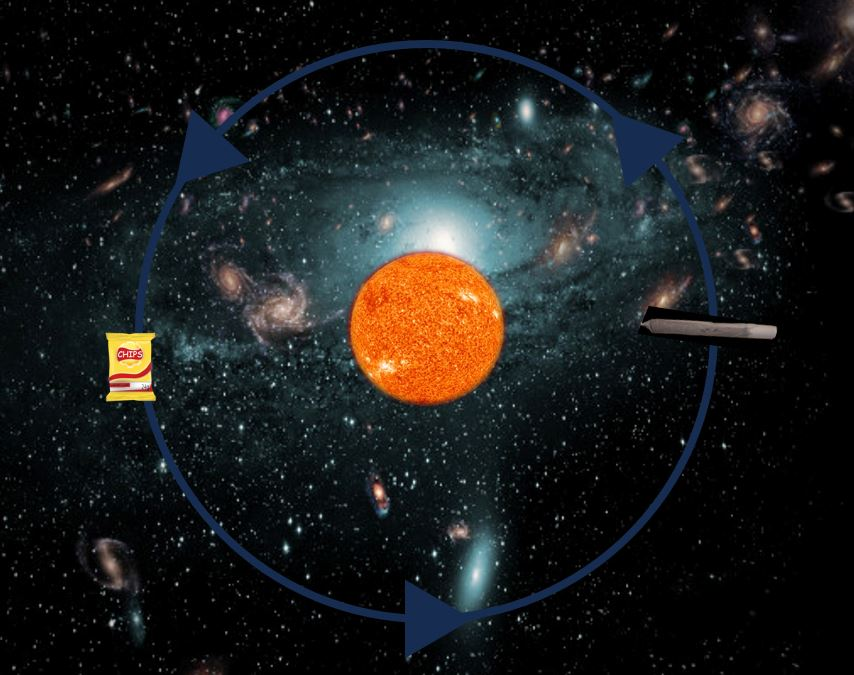
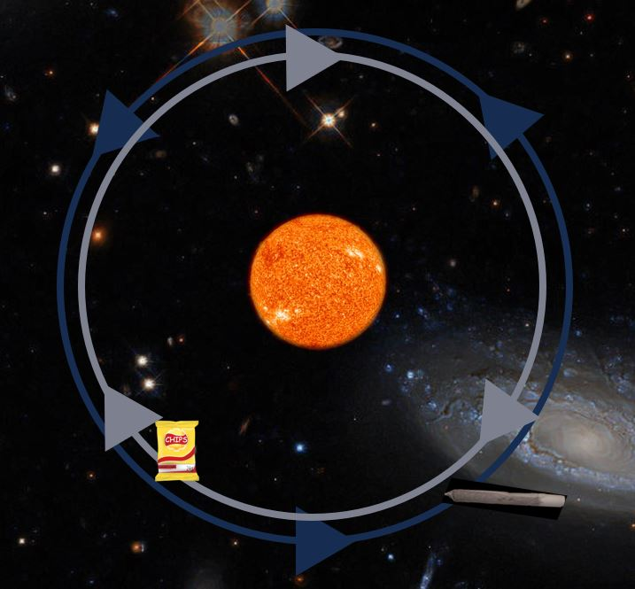

# The Layers Wiki

  

---

## Introduction

**The Layers Wiki** is an online, open-access documentation resource. The Layers describe an alternative way of perceiving reality. This may be confusing for non-participants of The Layers.
However, there is always the possibility to enter the Layers. Send a message to the Layer Conglomerate on GitHub to learn more.
Under the right circumstances we can arrange an entry together.

## Layers

The Layers should be imagined as an infinitely high, infinitely growing skyscraper.[^1]

* [Layer 0: The History of Origin](#layer-0:-the-history-of-origin)
* [Layer 6: Peter](#layer-6:-peter)
* [Layer 7: Augarten Eden and The Piss-Hell of Lendplatz](#layer-7:-augarten-eden-and-the-piss-hell-of-lendplatz)
* [Layer 8: The Human Factor](#layer-8:-the-human-factor)
* [Layer 58: LOST](#layer-58:-lost)
* [Layer 85: ****'s Medizin-Test Sprache](#layer-85:-****'s-medizin-test-sprache)

---

## Layer 0: The History of Origin

Layer 0 encapsulates the history of the origin of the Layers. It takes place in Zürich on the campus of the ETH - the motherland of Layers. On the day of origin, the creator discovered Layer 1 and Layer 1.1, thereby establishing the concept that is now accepted as consensus within the Layer community. Layer 0 also encompasses the Layer-roles of individuals and how they interact within those roles.
Some examples for Layer-roles:
* creator
* natural scientist
* chef
* explorer
* sports specialist
* peter
* gardener
* jukebox
* architect
* ...

  
## Layer 1: The Orbits of Joy
Layer 1 describes the concept of viewing planetary orbits around an imaginary mass at the centre of a group of friends passing around weed and snacks. However as the creator noticed Layer 1 is split up in infinite Layers. Different physical laws apply in each layer. So in Layer 1.0 the orbits are in the same direction whereas on Layer 1.1 the orbits are in different direction leading to planetery alignments twice a year.
### Layer 1.0
  

### Layer 1.1
  

## Layer 6: Peter

"Peter is a common masculine given name. It is derived directly from Greek Πέτρος, Petros (an invented, masculine form of Greek petra, the word for "rock" or "stone"), which itself was a translation of Aramaic Kefa ("stone, rock")[...]." [^2]  
The name peter goes back to the Petertime (also called stone age). At these times everybody was a Peter (see: [evidence](https://www.youtube.com/watch?si=gvMxdNVg4kW2Jk9w&v=QQVV1nOMFYk&feature=youtu.be)). But even though the origin of 'Peter' is deep, the question of why it is so widespread and anchored in human culture nowadays is of interest.  
Some examples for the spread of Peter:
* Miesepeter
* Lügenpeter
* Schwarzer Peter
* Struwelpeter
* Helge Schneider's regular use of the name
* Taylor Swift's song peter
* the authors of the "Steinbock-Sternzeichen" book
* ... 
<!-- end of the list -->
Some say that the reason for the Peter divulgation is connected to the mistery of the stonehenge. Others claim that everybody has a stone buried deep in one's soul. This stone would cause an intrinsic need for Peter.

## Layer 7: Augarten Eden and The Piss-Hell of Lendplatz

In the week before April 20, 2024 (Layer Entry V), the conglomerate is well-prepared (with vegetable sticks and hummus, among other things) to enjoy a vivid afternoon in Augarten Eden.
After a successful first OS submission (1st place) by ****** and ***** & a successful sound engineer project presentation by **** , everyone is smiling and the mood is relaxed. However, ****** and **** get carried away by their euphoric mood and ask **** on the phone if they are disturbing them at 6️⃣ (*** hears this😬). They immediately realize that they went too far: Layer 58 (the first harbinger of piss hell)!

But first, back to the paradisiacal Augarten Eden: the heavenly lantern-lit evening atmosphere is enjoyed to the fullest. ***** flies in the layers as if he were an indigenous inhabitant.
**** is overwhelmed by the dilemma of how to change his pants (long pants because of the temperature).
Everything is quite typical...

But: the Gardener keeps feeling as if his glued tooth is slipping out of place – strange.
After quite some time, they meet up with the 19 Tonis in the Lend district.
Here it happens: The encounter with the Piss-Hell of Lendplatz.
**** heads for a toilet at Lendplatz.
The double toilet option for women, which offers more space with two toilets, attracts hardly any crowds. Meanwhile, there is a long line in front of the men's restroom.
Photo A shows the first man in line telling a skeptical woman that the women's restroom is actually empty.
Each time the door to the men's restroom opens, a strong smell of ammonia wafts out.
When **** finally enters the toilet, it becomes clear why. 
Barely all urinals are cordoned off with tape saying “do not use, out of order.” Nevertheless, three out of the four urinals are filled with urine. The one toilet booth in the back, however, has a working flush.
Following up: The idiotic men convince themselves that the fourth urinal is still draining instead of realizing that it most likely just hasn't overflowed yet!
The blocked urinal continues to be used just like the three others before it. The smell of ammonia is so strong that it brings tears to the gardener's eyes.
The definition of hell!
Somehow, endearing male idiocy leads to the most intensely smelly place **** has ever encountered.

So, in one evening, the gardener experienced both: heaven in Augarten Eden and the Piss-Hell at the Lendplatz toilet.
The double-edged discovery of the hell and heaven of the Layers!

---
## Layer 8: The Human Factor

In informatics, specifically in computer network theory, there is its own Layer theory. These Layers have different meanings and are structured differently. However, the aforementioned OSI model shares a hidden Layer 8 with this Layer theory. **The human factor**.
The first 7 Layers of the OSI model are very well documented in a YouTube video: https://www.youtube.com/watch?v=KHMwhjQrCmo

However sometimes the problem is occurring on another Layer - the person interacting with the machine. The problem is occurring on **Layer 8**. 

---

## Layer 58: LOST
Lost = Layer 58

---

[^1]: The linear order is in fact just a simplification. For information about the Layers beyond linear order, click [here](./complex-Layers/complex-Layer-Wiki.md).
[^2]: [wikipedia - peter](https://en.wikipedia.org/wiki/Peter_(given_name))
